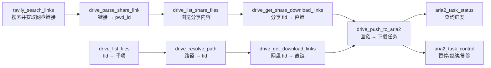
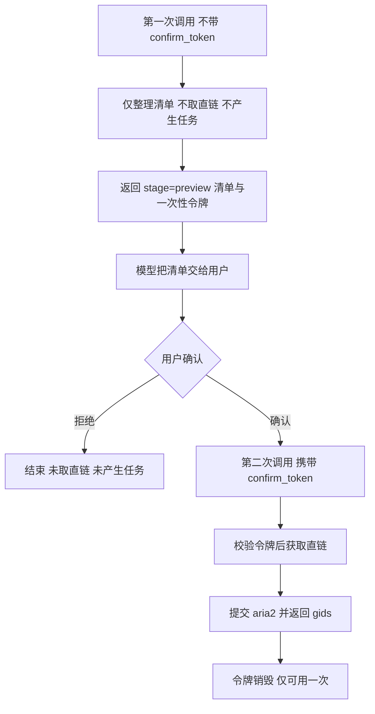
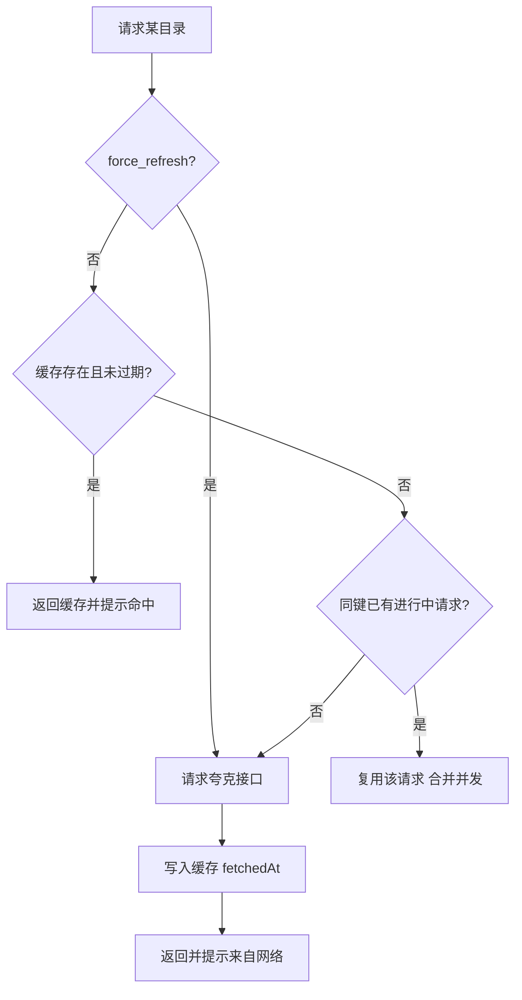

# quark-drive-mcp — 夸克网盘 MCP 服务

基于官方 [`@modelcontextprotocol/sdk`](https://github.com/modelcontextprotocol/typescript-sdk) 构建的 MCP 服务，
把**夸克网盘文件查询**、**下载直链获取**与 **aria2 RPC 下载**封装为可供模型调用的工具。

同时支持 **stdio** 与 **Streamable HTTP** 两种传输；敏感信息全部通过环境变量注入，不落库、不入库。

---

## 环境要求

| 项目                      | 版本             |
| ------------------------- | ---------------- |
| Node.js                   | `>= 20.19`       |
| pnpm                      | `>= 9`           |
| @modelcontextprotocol/sdk | `^1.17.0`        |
| zod                       | `^3.25.76`       |
| dotenv                    | `^16.4.5`        |
| hono                      | `^4.13.11`       |
| @hono/node-server         | `^2.1.3`         |
| vitest（仅开发/测试）     | `^5.0.2`         |

> Node 版本以 `>= 20.19` 为准：服务本身最低可跑在 18，但测试工具链 vitest 5 需要 20.19+。
>
> 本项目使用 **pnpm** 管理依赖，锁文件为 [`pnpm-lock.yaml`](pnpm-lock.yaml:1)，请勿再使用 npm/yarn 安装。
> 若此前用 npm 装过依赖，建议先删除 `node_modules` 目录再执行 `pnpm install`，避免两套布局混用。
>
> 依赖布局使用 pnpm 默认的 **isolated** 模式，无需任何额外配置。
> 若安装后运行时报 `Cannot find module 'dotenv'` / `'vitest'`，通常是 Windows 上 pnpm 重建 `node_modules`
> 时被文件占用（杀毒软件实时扫描、编辑器索引、正在运行的 MCP 服务）导致个别包不完整——
> 重跑 `pnpm install --force` 即可修复（见文末「已知问题与踩坑」）。

## 快速开始

```bash
# 安装依赖
pnpm install

# 1) 配置凭证：复制模板并填写
#    Windows:  copy .env.example .env
#    macOS/Linux: cp .env.example .env

# 2) 以 stdio 启动（供 MCP 客户端拉起）
pnpm start

# 以 Streamable HTTP 启动，默认 http://127.0.0.1:3000/mcp
pnpm start:http

# 开发模式（--watch 自动重启）
pnpm dev

# 运行测试
pnpm test

# 用官方 MCP Inspector 可视化调试
pnpm inspect
```

命令行参数：

```bash
node src/index.js --transport=http --port=3000 --host=0.0.0.0 --path=/mcp
node src/index.js --help
```

---

## 环境变量

所有敏感信息都从环境变量读取，加载顺序为 **真实环境变量 > 项目根目录 `.env`**
（dotenv 默认不覆盖已存在的变量，因此 MCP 客户端 `env` 中注入的值优先级最高）。

**实际只需要填写三项**（链接、密钥、密码），其余变量都有合理默认值，无需设置：

| 变量名             | 必填 | 说明                                                             |
| ------------------ | ---- | ---------------------------------------------------------------- |
| `ARIA2_RPC_URL`    | ✅   | aria2 RPC 地址（链接），如 `http://your-aria2-host:6800/jsonrpc` |
| `ARIA2_RPC_SECRET` | ✅   | aria2 `rpc-secret` 原始值（密钥）；RPC 未设密码则留空            |
| `QUARK_COOKIE`     | ✅   | 夸克网盘登录凭证（密码），从浏览器开发者工具复制                 |

以下均为可选项，不填即使用默认值：

| 变量名                    | 默认值                   | 说明                                                                       |
| ------------------------- | ------------------------ | -------------------------------------------------------------------------- |
| `MCP_HTTP_TOKEN`          | 空                       | **HTTP 模式访问令牌**；配置后所有请求必须带 `Authorization: Bearer <令牌>` |
| `MCP_HTTP_ALLOW_INSECURE` | 空                       | 设为 `1` 才允许「非回环地址 + 无令牌」监听（默认直接拒绝启动）              |
| `ARIA2_DOWNLOAD_DIR`      | 空                       | 默认下载目录，留空则用 aria2 自身配置                                      |
| `MCP_LOG_LEVEL`           | `info`                   | `debug` / `info` / `warn` / `error` / `silent`                             |
| `DRIVE_CACHE_TTL_MS`      | `3600000`（1 小时）      | 目录缓存有效期（毫秒）                                                     |
| `DRIVE_CACHE_MAX_ENTRIES` | `500`                    | 缓存条目上限，超限按 LRU 淘汰；**设为 `0` 即关闭缓存**                      |
| `CONFIRM_TTL_MS`          | `300000`（5 分钟）       | 写操作确认令牌的有效期（毫秒）                                             |
| `TAVILY_API_KEY`          | 空                       | Tavily 搜索 API 密钥，启用搜索/提取工具时必填                              |
| `TAVILY_BASE_URL`         | `https://api.tavily.com` | Tavily API 地址                                                            |
| `QUARK_BASE_URL`          | `https://drive.quark.cn` | 接口域名                                                                   |
| `QUARK_USER_AGENT`        | 夸克 PC 客户端 UA        | 伪装 UA，**必须为夸克 PC 客户端 UA**；浏览器 UA 取直链会被拒（code=23018） |
| `QUARK_REFERER`           | `https://pan.quark.cn/`  | 请求 Referer                                                               |
| `QUARK_ORIGIN`            | `https://pan.quark.cn`   | 请求 Origin                                                                |
| `QUARK_PR`                | `ucpro`                  | 接口公共 query `pr`                                                        |
| `QUARK_FR`                | `pc`                     | 接口公共 query `fr`                                                        |
| `UC_PARAM_STR`            | `dn`                     | 接口公共 query `uc_param_str`                                              |

**启用 Tavily 搜索 / 提取功能**（可选）：在 [Tavily](https://tavily.com) 注册后获取 API Key（`tvly-` 开头），写入 `.env`：

```bash
# Tavily 搜索 API 密钥（tvly- 开头）
TAVILY_API_KEY=tvly-xxxxxxxxxxxxxxxx
```

或由 MCP 客户端 `env` 注入。不配置时网盘与 aria2 功能不受影响，仅 `tavily_search` / `tavily_extract_links` 不可用。

完整说明见 [`.env.example`](.env.example:1)。`.env` 已被 [`.gitignore`](.gitignore:4) 忽略，请勿提交真实凭证。

---

## 接入 MCP 客户端

### 方式一：stdio（推荐本地使用）

把下面的模板粘贴到 MCP 客户端配置中，只需填写 `env` 里的链接、密钥、密码三项即可：

```json
{
  "mcpServers": {
    "quark-drive-mcp": {
      "command": "node",
      "args": ["c:/path/to/quark-drive-mcp/src/index.js"],
      "env": {
        "ARIA2_RPC_URL": "http://your-aria2-host:6800/jsonrpc",
        "ARIA2_RPC_SECRET": "在此填写 aria2 密钥，未设置则留空",
        "QUARK_COOKIE": "在此填写夸克网盘 Cookie",
        "TAVILY_API_KEY": "tvly-在此填写 Tavily API 密钥（可选，用于搜索/提取）",
        "ARIA2_DOWNLOAD_DIR": "/downloads",
        "MCP_LOG_LEVEL": "info"
      },
      "disabled": false
    }
  }
}
```

字段说明：

- `ARIA2_RPC_URL`：**链接** —— aria2 RPC 地址
- `ARIA2_RPC_SECRET`：**密钥** —— 对应 aria2 的 `rpc-secret`（不要带 `token:` 前缀）
- `QUARK_COOKIE`：**密码** —— 夸克网盘登录 Cookie
- `TAVILY_API_KEY`：**Tavily 搜索密钥**（可选）—— 启用 `tavily_search` / `tavily_extract_links` 时填写
- `disabled`：设为 `true` 可临时禁用该服务；若客户端不支持该字段，删除这一行即可
- 其余变量都有默认值，可全部不填；`ARIA2_DOWNLOAD_DIR` 留空时使用 aria2 自身配置的目录

VS Code 用户也可直接编辑仓库内的 [`.vscode/mcp.json`](.vscode/mcp.json:1)，字段含义与上表完全相同。

### 方式二：Streamable HTTP（Hono 实现，远程 / 共享）

```bash
# 仅本机使用（默认，无需令牌）
pnpm start:http

# 需要被其它机器访问：必须配置令牌
pnpm start:http -- --token=my-secret-token
# 或
MCP_HTTP_TOKEN=my-secret-token pnpm start:http
```

客户端连接 `http://127.0.0.1:3000/mcp`。协议流程为：
`POST /mcp` 携带 `initialize` → 响应头返回 `mcp-session-id` → 后续请求携带该头维持会话；
`GET /mcp` 接收服务端通知流，`DELETE /mcp` 销毁会话；另有 `GET /health` 健康检查。

#### 访问令牌（鉴权）

本服务持有夸克 Cookie，等价于「你的网盘读取 + 下载权限」，因此 HTTP 模式有两道防护：

1. **默认拒绝危险组合**。监听地址不是回环地址（非 `127.x` / `::1` / `localhost`）且未配置令牌时，
   进程直接以退出码 `1` 退出并打印修复指引，不会带着完整网盘权限裸奔。
   确有外层防护（反向代理、内网隔离）时，用 `--allow-insecure` 或 `MCP_HTTP_ALLOW_INSECURE=1` 显式接受风险。
2. **配置令牌后全量校验**。除 CORS 预检（`OPTIONS`）外，**所有**请求（含 `/health`）都必须携带
   `Authorization: Bearer <令牌>`，否则返回 `401`。令牌比较走常量时间实现，避免按响应耗时逐字节试探。

##### 令牌从哪来

它不是向夸克或任何平台申请的凭证，而是**你自己生成的一个共享密钥**——服务端与客户端约定同一个字符串即可。
换掉它就等于让所有旧客户端立即失效，这也是唯一的「吊销」手段。

```bash
# 推荐：64 位十六进制
openssl rand -hex 32

# 没有 openssl 时用 Node
node -e "console.log(require('crypto').randomBytes(32).toString('base64url'))"
```

##### 配到哪里

三处任选其一，**优先级从高到低**：

| 位置                     | 写法                          | 适用场景                          |
| ------------------------ | ----------------------------- | --------------------------------- |
| 命令行                   | `--token=<令牌>`              | 临时调试                          |
| 进程环境变量             | `MCP_HTTP_TOKEN=<令牌>`       | 容器 / 进程管理器注入             |
| 项目根目录 `.env`        | `MCP_HTTP_TOKEN=<令牌>`       | 本机长期使用（已被 `.gitignore`） |

> `.env` 由 [`src/env.js`](src/env.js:17) 按**项目根目录**定位（与进程 cwd 无关）加载，
> 且 dotenv 不覆盖已存在的变量，因此优先级实际是「命令行 > 真实环境变量 > `.env`」。
> 注意 `--token=`（显式空值）会把令牌置空，此时非回环地址会重新触发上面的拒绝启动。

下面是示例，`my-secret-token` 请替换成你自己生成的值：

```bash
# 未带令牌 → 401
curl -i http://127.0.0.1:3000/health

# 带令牌 → 200
curl -i -H "Authorization: Bearer my-secret-token" http://127.0.0.1:3000/health

# MCP 请求除了令牌，还需要 MCP 协议要求的 Accept 头
curl -i -X POST http://127.0.0.1:3000/mcp \
  -H "Authorization: Bearer my-secret-token" \
  -H "Content-Type: application/json" \
  -H "Accept: application/json, text/event-stream" \
  -d '{"jsonrpc":"2.0","id":1,"method":"initialize","params":{"protocolVersion":"2025-06-18","capabilities":{},"clientInfo":{"name":"curl","version":"1.0"}}}'
```

> ⚠️ 即使配置了令牌，HTTP 模式下多个客户端会话仍共享同一份内存缓存（见下文），
> 且服务不做多租户隔离。若需暴露到公网，请在前面再加一层 TLS 与网关。
> 当前是否启用令牌可通过 `GET /health` 的 `authRequired` 字段或 `config://server` 资源的 `httpAuthRequired` 查看。

---

## 能力清单

### Tools（工具）

| 名称                             | 关键入参                                                  | 说明                                                            |
| -------------------------------- | --------------------------------------------------------- | --------------------------------------------------------------- |
| `drive_list_files`               | `pdir_fid`、`page`、`size`、`force_refresh`               | 列出一层目录，支持分页，返回缓存提示                            |
| `drive_resolve_path`             | `path`、`force_refresh`                                   | 把 `/film/明天也要上班` 逐层解析为 `fid`                        |
| `drive_get_download_links`       | `fids`                                                    | 按文件 `fid` 获取带签名的下载直链（约 1 小时有效）              |
| `drive_push_to_aria2`            | `fids`/`share_fids`/`urls`、`dir`、`out`、`confirm_token` | 两阶段提交：先返回待确认清单，用户确认后才下载                  |
| `aria2_task_status`              | `gids`                                                    | 查询任务状态、进度与保存路径                                    |
| `aria2_task_control`             | `gids`、`action`                                          | `pause` / `unpause` / `remove` / `forceRemove` / `removeResult` |
| `drive_cache_manage`             | `action`、`pdir_fid`                                      | 查看缓存统计，或 `clear` / `invalidate` 清理                    |
| `tavily_search`                  | `query`、`max_results`、`search_depth`                    | 基于 Tavily 的关键词 AI 搜索，返回标题/URL/摘要                 |
| `tavily_extract_links`           | `urls`、`extract_depth`                                   | 读取指定页面正文并提取网盘分享链接                              |
| `tavily_search_links`            | `query`、`max_results`、`extract_limit`                   | 一步完成搜索 + 抓正文 + 提取网盘链接（含提取码）                |
| `drive_parse_share_link`         | `link`                                                    | 解析分享链接为 `pwd_id` 与提取码（不发起网络请求）              |
| `drive_list_share_files`         | `link` 或 `pwd_id`、`passcode`、`pdir_fid`                | 浏览分享内文件（只读）                                          |
| `drive_get_share_download_links` | `link`/`pwd_id`、`passcode`、`fids`/`path`                | **无需转存**，直接换取分享内文件的下载直链                      |

典型调用链：



> 说明：分享内文件的 `fid` 属于分享空间，与本账号网盘 `fid` 不同 —— 前者用 `drive_get_share_download_links`，
> 后者用 `drive_get_download_links`。两条链路拿到直链后都统一交给 `drive_push_to_aria2` 下载，**全程无需转存**。

### 写操作确认闸门

`drive_push_to_aria2` 是唯一的写操作，采用**两阶段提交**，避免模型擅自下载或误选文件浪费直链：



清单包含：文件名、大小、类型、来源（自有网盘 / 分享 / 直接地址）、地址、下载位置预览与合计大小。

令牌的安全性质：

- **绑定计划内容**：提交时直接执行预览时锁定的计划，不重新解析入参，杜绝「预览 A、提交 B」
- **一次性使用**：消费后立即销毁，重复使用报错
- **有效期**：默认 5 分钟（`CONFIRM_TTL_MS` 可调），过期需重新预览
- **提交阶段禁止再传目标参数**：同时传 `fids`/`share_fids`/`urls` 会被拒绝

### Resources（资源）

| URI               | MIME 类型          | 说明                                       |
| ----------------- | ------------------ | ------------------------------------------ |
| `config://server` | `application/json` | 服务配置（**敏感值已脱敏**）与目录缓存统计 |
| `docs://usage`    | `text/markdown`    | 工具清单、推荐调用顺序与缓存说明           |

---

## 缓存机制

逐层解析一个路径需要「每一层一次请求」。目录结构变化并不频繁，因此每个目录一层的查询结果都会被缓存，
重复解析同一路径时中间层直接命中，显著减少请求次数与风控风险。

- **缓存键**：`pdir_fid:page:size`，不同分页结果互不覆盖
- **作用域**：`src/drive/cache.js` 中的模块级单例，进程内所有会话共享；进程退出即失效
- **TTL**：默认 1 小时，由 `DRIVE_CACHE_TTL_MS` 控制，过期按未命中处理
- **容量**：默认上限 500 条，超限按 LRU 淘汰，由 `DRIVE_CACHE_MAX_ENTRIES` 控制；
  设为 `0` 即完全关闭缓存（所有查询都实时打夸克接口），`drive_cache_manage` 会回报 `enabled: false`
- **并发合并**：同一目录并发未命中时复用同一个进行中的请求，避免重复打夸克接口
- **缓存提示**：查询类工具会在文本与 `structuredContent.cache` 中标注
  「缓存命中（数据获取于 N 秒前）/ 来自网络」，并用 `force_refresh=true` 可单次绕过缓存
- **直链不缓存**：`download_url` 带 `auth_key` 签名有效期（约 1 小时），缓存会导致下载失败，故每次实时获取



---

## 性能观测量与基线

三个搜索工具都会在返回值中带 `timing` 字段，便于定位瓶颈：

| 字段                              | 含义                                    |
| --------------------------------- | --------------------------------------- |
| `searchMs`                        | 搜索阶段耗时（毫秒）                    |
| `extractMs`                       | 正文抓取阶段耗时（毫秒），未抓取时为 0  |
| `totalMs`                         | 本工具总耗时（毫秒）                    |
| `pagesRequested` / `pagesFetched` | 请求抓取的页面数 / 实际返回正文的页面数 |

另外两层观测：

- 每次 Tavily 请求都会在 `MCP_LOG_LEVEL=debug` 下打点：`Tavily /extract 返回：1289ms（HTTP 200，响应 19009 字符）`
- 累计统计可通过 `config://server` 资源的 `tavilyCalls` 字段查看（各端点调用次数、平均 / 最近 / 最大耗时）

实测基线（`max_results=6`、`extract_limit=5`、`extract_depth=advanced`，同关键词连跑 3 次取中位数）：

| 场景                                          | 耗时                                       |
| --------------------------------------------- | ------------------------------------------ |
| `/search`                                     | `1986ms`（区间 1687–2902ms，首次含冷启动） |
| `/extract` 抓「搜索刚命中过的页面」（5 页）   | `1289ms`（区间 1103–2585ms）               |
| `tavily_search_links` 合计                    | `3089ms`（区间 2976–5491ms）               |
| `/extract` 抓「搜索未抓过的陌生页面」（3 页） | `17854ms`                                  |

**关键结论：`/extract` 的耗时主要由「Tavily 侧是否已缓存该 URL」决定，而不是页数。**
抓刚被搜索命中的页面约 1.1–2.6 秒；抓陌生页面需现场抓取，实测 17.9 秒，相差约 16 倍。
因此后续提速的重点是：优先复用搜索结果中的 URL、对已抓过的 URL 做本地缓存、并对确定抓不到的域名做负缓存。

## 项目结构

```
quark-drive-mcp/              # 项目目录（实际路径以你的克隆位置为准）
├── src/
│   ├── index.js                # CLI 入口：参数解析、传输选择、暴露面防护、优雅退出
│   ├── server.js               # 组装 McpServer，注册 tools / resources
│   ├── env.js                  # 静默加载 .env，提供 envStr / envInt
│   ├── config.js               # 集中配置与脱敏快照
│   ├── logger.js               # 统一日志（严格写入 stderr）
│   ├── drive/
│   │   ├── quark-client.js     # 夸克接口：列目录 + 取直链
│   │   ├── cache.js            # 目录内存缓存（TTL / LRU / 并发合并）
│   │   ├── file-service.js     # 缓存编排、路径解析、结果裁剪
│   │   ├── share-service.js    # 分享解析、浏览与分享内直链
│   │   ├── confirm-store.js    # 写操作的一次性确认令牌
│   │   └── aria2-client.js     # aria2 JSON-RPC 客户端
│   ├── tools/
│   │   ├── index.js            # 工具注册入口
│   │   ├── shared.js           # 错误转换与展示格式化
│   │   ├── drive.js            # 网盘工具（查询 / 解析 / 取链 / 缓存）
│   │   ├── share.js            # 分享工具（解析 / 浏览 / 分享内直链）
│   │   ├── aria2.js            # aria2 工具（提交 / 状态 / 控制）
│   │   └── search.js           # Tavily 搜索与链接提取
│   ├── resources/
│   │   ├── index.js
│   │   └── app-info.js         # config://server 与 docs://usage
│   └── transports/
│       ├── stdio.js            # 标准输入输出传输
│       └── http.js             # Streamable HTTP 传输（Hono：路由 + CORS + 令牌鉴权 + 会话管理）
├── test/                       # vitest 单测
├── vitest.config.js            # 测试配置（显式 include，避免扫到依赖目录）
├── .env.example                # 环境变量模板
└── .vscode/mcp.json            # VS Code MCP 接入配置（交互式输入密钥）
```

## 测试

```bash
pnpm test          # 单次运行
pnpm test:watch    # 监听模式
```

测试聚焦「逻辑密度高、又不需要真实网络」的部分：

| 测试文件                        | 覆盖内容                                                     |
| ------------------------------- | ------------------------------------------------------------ |
| `test/cache.test.js`            | TTL 过期边界、LRU 淘汰顺序、按目录失效、容量为 0 时关闭缓存   |
| `test/file-service.test.js`     | 路径拆分、逐层解析、找不到 / 同名歧义、缓存复用与强制刷新     |
| `test/share-links.test.js`      | 多平台链接提取、URL 规范化、去重与「互为前缀」残链过滤        |
| `test/share-service.test.js`    | 分享链接解析（`/s/`、`/share/`、pwd 参数、裸 pwd_id、报错）   |
| `test/confirm-store.test.js`    | 令牌一次性消费、绑定计划内容、过期失效、统计计数             |
| `test/aria2-out-name.test.js`   | 落盘文件名清洗（路径分隔符、控制字符、`.` / `..`、占位符）     |

`resolvePath` 依赖夸克接口，测试中通过 `vi.mock` 替换 `quark-client` 为内存目录树，因此无需凭证即可运行。

## 扩展新能力

**新增一个工具**：在 [`src/tools/`](src/tools:1) 下新建文件，导出 `registerXxxTools(server)`，
然后在 [`src/tools/index.js`](src/tools/index.js:1) 中引入一行。

```js
import { z } from 'zod';

export function registerHelloTool(server) {
  server.registerTool(
    'hello',
    {
      title: '打个招呼',
      description: '向指定的人问好。',
      inputSchema: { name: z.string().describe('对方姓名') },
      annotations: { readOnlyHint: true, openWorldHint: false },
    },
    async ({ name }) => ({
      content: [{ type: 'text', text: `你好，${name}！` }],
    }),
  );
}
```

---

## 关键实现说明

1. **日志绝不写 stdout**
   stdio 传输下 stdout 被 JSON-RPC 协议独占，任何多余输出都会破坏握手。
   [`src/logger.js`](src/logger.js:1) 统一写 stderr，dotenv 也以静默模式加载。

2. **敏感信息只存在于环境变量**
   Cookie、RPC 地址与密钥通过 [`src/config.js`](src/config.js:1) 集中读取，
   `config://server` 资源只暴露脱敏快照，绝不打印明文。

3. **业务错误用 `isError` 而非抛异常**
   凭证缺失、目录不存在、同名歧义、RPC 拒绝等可预期错误返回 `isError: true` 与可读文案，
   让模型有机会自我修正；只有真正的程序缺陷才向上抛。

4. **结构化输出优先**
   带 `outputSchema` 的工具同时返回 `content`（自然语言）与 `structuredContent`（严格结构）。
   注意 SDK 对 `structuredContent` 是**严格校验**（`additionalProperties: false`），
   返回前必须显式裁剪为 schema 声明的字段。

5. **传输与能力解耦**
   [`src/server.js`](src/server.js:1) 只负责注册能力并返回全新的 `McpServer` 实例；
   HTTP 模式下每个会话绑定独立实例，但目录缓存为模块级单例，因此跨会话共享。

6. **暴露面默认安全**
   服务持有夸克 Cookie，等价于网盘读写权限，所以 [`src/index.js`](src/index.js:1)
   在监听非回环地址且未配置令牌时直接拒绝启动，而不是只打一行警告；
   [`src/transports/http.js`](src/transports/http.js:1) 在配置令牌后对**所有**请求
   （含 `/health`）做常量时间比较的 Bearer 校验，仅放行 CORS 预检。

7. **日志级别延迟读取**
   [`src/logger.js`](src/logger.js:1) 在每次写入时读 `MCP_LOG_LEVEL`，而不是在模块求值时固化。
   `.env` 由 `env.js` 加载，两者求值顺序取决于 import 图细节；延迟读取消除了这个隐式依赖。

8. **HTTP 传输基于 Hono**
   [`src/transports/http.js`](src/transports/http.js:1) 直接用 SDK 的
   `WebStandardStreamableHTTPServerTransport`（吃 `Request`、吐 `Response`）配合
   [Hono](https://hono.dev) 实现：路由、CORS、Bearer 鉴权都是声明式中间件，
   不再手写 Node `req`/`res` 分支；监听交由 `@hono/node-server` 的 `serve()`。
   ⚠️ 中间件顺序固定为「CORS → 鉴权」：浏览器预检（`OPTIONS`）按规范不携带 `Authorization`，
   `hono/cors` 会对预检直接短路返回 204，因此这个顺序既不误伤预检也不构成绕过。
   ⚠️ 无会话的 `POST` 需要先读请求体判断是否为 `initialize`，读过的 body 必须通过
   `handleRequest(request, { parsedBody })` 交回去，否则传输层会再读一次已消费的流并报 400。

---

## 常见问题（踩坑记录）

| 现象                                                                                                         | 根因                                                                            | 处理                                                                                                          |
| ------------------------------------------------------------------------------------------------------------ | ------------------------------------------------------------------------------- | ------------------------------------------------------------------------------------------------------------- |
| 取直链报 `code=23018 download file size limit`（任何体积的文件都报，含 900MB 小文件）                        | UA 不是夸克 PC 客户端 UA，被判定为非客户端请求                                  | 使用夸克 PC 客户端 UA（`config.js` 已作为默认值内置；可用 `QUARK_USER_AGENT` 覆盖）                           |
| aria2 任务长期停在 `active`、`totalLength=0`、`0 B/s`；用 curl/node 请求直链返回 **412 Precondition Failed** | 直链走 CDN（`dl-pc-zb.drive.quark.cn`），存在防盗链校验，仅带 UA + Referer 不够 | 下载请求头必须同时带上 `Cookie`（`aria2-client.js` 的 `buildDownloadHeaders()` 已注入 UA + Referer + Cookie） |
| 提交任务后 `dir` 变成 `C:/.../PortableGit/film/...`                                                          | Windows 下 Git Bash（MSYS）会把参数/环境变量里的 `/film/...` 当 POSIX 路径转换  | 用支持 Windows 的 shell（PowerShell/CMD）执行，或确保 `dir` 不经由 Git Bash 传参                              |
| `pnpm install` 后运行时报 `Cannot find module 'dotenv'` / `'vitest'`，或 `--force` 报 `failed to rename staging directory ... 拒绝访问 (os error 5)` | Windows 下 `node_modules` 被文件占用（Defender 实时扫描、编辑器索引、正在运行的 MCP 服务），pnpm 删不掉被锁的包目录，留下空壳后 rename 冲突 | 先停掉占用该目录的进程（本项目自身的 MCP 服务也算），再重跑 `pnpm install --force`；瞬时锁多试几次即可补齐 |
| 在 `.npmrc` 里写 `node-linker=hoisted` 毫无效果 | pnpm 11+ 只从 `.npmrc` 读取**鉴权与 registry** 配置，其余设置（`nodeLinker`、`hoistPattern` 等）必须写在 `pnpm-workspace.yaml` 或全局 `~/.config/pnpm/config.yaml` | 需要 hoisted 时改在 `pnpm-workspace.yaml` 配 `nodeLinker: hoisted`；本项目用默认 isolated 即可 |
| `pnpm test` 报一堆 `node_modules.*/zod/...` 的用例失败                                                        | 测试默认 include 会扫到仓库里任何 `*.test.*`，包括遗留的备份目录                | [`vitest.config.js`](vitest.config.js:1) 已显式限定 `include: ["test/**/*.test.js"]`；另请删除遗留备份目录     |
| HTTP 模式启动即退出并打印「拒绝启动」                                                                        | 监听非回环地址（如 `0.0.0.0`）但未配置令牌，被暴露面防护拦下                    | 配置 `--token` / `MCP_HTTP_TOKEN`，或确认有外层防护后加 `--allow-insecure`                                     |

### HTTP 传输（Hono）相关

| 现象                                                                                     | 根因                                                                                          | 处理                                                                                                       |
| ---------------------------------------------------------------------------------------- | --------------------------------------------------------------------------------------------- | ---------------------------------------------------------------------------------------------------------- |
| `OPTIONS` 预检被 401 拦下，浏览器跨域直接失效                                            | 鉴权中间件排在了 CORS 之前，而预检请求按规范不携带 `Authorization`                             | 中间件顺序固定为「CORS → 鉴权」；`hono/cors` 对预检短路返回 204，不进入后续中间件                           |
| 自己读完 body 再调 `transport.handleRequest(request)`，报 `400 Parse error: Invalid JSON` | Web Standard 传输默认会再读一次请求体，而流已被消费，拿到空字符串                              | 把解析好的 body 用 `handleRequest(request, { parsedBody })` 传进去；本项目只在「无会话的 POST」分支预读     |
| 想给 Hono 用 SDK 的 `StreamableHTTPServerTransport`，从 `c.env` 取 Node `req`/`res` 会很别扭 | 该 transport 是 Node↔Web 适配层（内部同样用 `@hono/node-server`），会自己把响应写进 `outgoing` | 直接用 `WebStandardStreamableHTTPServerTransport`：`return transport.handleRequest(c.req.raw)`，少一层适配  |

---

## 许可

MIT
