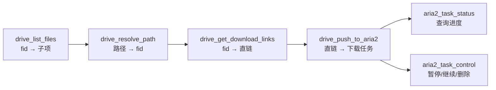
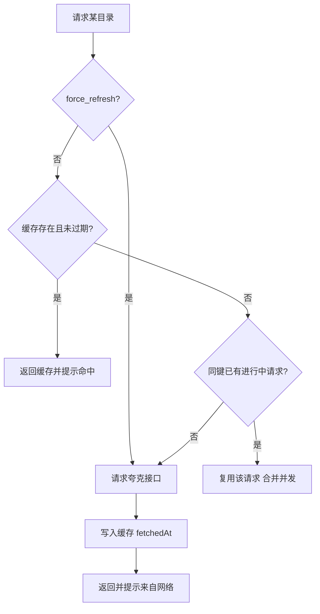

# quark-drive-mcp — 夸克网盘 MCP 服务

基于官方 [`@modelcontextprotocol/sdk`](https://github.com/modelcontextprotocol/typescript-sdk) 构建的 MCP 服务，
把**夸克网盘文件查询**、**下载直链获取**与 **aria2 RPC 下载**封装为可供模型调用的工具。

同时支持 **stdio** 与 **Streamable HTTP** 两种传输；敏感信息全部通过环境变量注入，不落库、不入库。

---

## 环境要求

| 项目                      | 版本       |
| ------------------------- | ---------- |
| Node.js                   | `>= 18`    |
| pnpm                      | `>= 9`     |
| @modelcontextprotocol/sdk | `^1.17.0`  |
| zod                       | `^3.25.76` |
| dotenv                    | `^16.4.5`  |

> 本项目使用 **pnpm** 管理依赖，锁文件为 [`pnpm-lock.yaml`](pnpm-lock.yaml:1)，请勿再使用 npm/yarn 安装。
> 若此前用 npm 装过依赖，建议先删除 `node_modules` 目录再执行 `pnpm install`，避免两套布局混用。

## 快速开始

```bash
# 安装依赖
pnpm install

# 1) 配置凭证：复制模板并填写
#    Windows:  copy .env.example .env
#    macOS/Linux: cp .env.example .env

# 2) 以 stdio 启动（供 MCP 客户端拉起）
pnpm start

# 以 Streamable HTTP 启动，默认 http://127.0.0.1:3000/mcp
pnpm start:http

# 开发模式（--watch 自动重启）
pnpm dev

# 用官方 MCP Inspector 可视化调试
pnpm inspect
```

命令行参数：

```bash
node src/index.js --transport=http --port=3000 --host=0.0.0.0 --path=/mcp
node src/index.js --help
```

---

## 环境变量

所有敏感信息都从环境变量读取，加载顺序为 **真实环境变量 > 项目根目录 `.env`**
（dotenv 默认不覆盖已存在的变量，因此 MCP 客户端 `env` 中注入的值优先级最高）。

**实际只需要填写三项**（链接、密钥、密码），其余变量都有合理默认值，无需设置：

| 变量名             | 必填 | 说明                                                             |
| ------------------ | ---- | ---------------------------------------------------------------- |
| `ARIA2_RPC_URL`    | ✅   | aria2 RPC 地址（链接），如 `http://your-aria2-host:6800/jsonrpc` |
| `ARIA2_RPC_SECRET` | ✅   | aria2 `rpc-secret` 原始值（密钥）；RPC 未设密码则留空            |
| `QUARK_COOKIE`     | ✅   | 夸克网盘登录凭证（密码），从浏览器开发者工具复制                 |

以下均为可选项，不填即使用默认值：

| 变量名                    | 默认值                   | 说明                                                                       |
| ------------------------- | ------------------------ | -------------------------------------------------------------------------- |
| `ARIA2_DOWNLOAD_DIR`      | 空                       | 默认下载目录，留空则用 aria2 自身配置                                      |
| `MCP_LOG_LEVEL`           | `info`                   | `debug` / `info` / `warn` / `error` / `silent`                             |
| `DRIVE_CACHE_TTL_MS`      | `3600000`（1 小时）      | 目录缓存有效期（毫秒）                                                     |
| `DRIVE_CACHE_MAX_ENTRIES` | `500`                    | 缓存条目上限，超限按 LRU 淘汰                                              |
| `TAVILY_API_KEY`          | 空                       | Tavily 搜索 API 密钥，启用搜索/提取工具时必填                              |
| `TAVILY_BASE_URL`         | `https://api.tavily.com` | Tavily API 地址                                                            |
| `QUARK_BASE_URL`          | `https://drive.quark.cn` | 接口域名                                                                   |
| `QUARK_USER_AGENT`        | 夸克 PC 客户端 UA        | 伪装 UA，**必须为夸克 PC 客户端 UA**；浏览器 UA 取直链会被拒（code=23018） |
| `QUARK_REFERER`           | `https://pan.quark.cn/`  | 请求 Referer                                                               |
| `QUARK_ORIGIN`            | `https://pan.quark.cn`   | 请求 Origin                                                                |
| `QUARK_PR`                | `ucpro`                  | 接口公共 query `pr`                                                        |
| `QUARK_FR`                | `pc`                     | 接口公共 query `fr`                                                        |
| `UC_PARAM_STR`            | `dn`                     | 接口公共 query `uc_param_str`                                              |

**启用 Tavily 搜索 / 提取功能**（可选）：在 [Tavily](https://tavily.com) 注册后获取 API Key（`tvly-` 开头），写入 `.env`：

```bash
# Tavily 搜索 API 密钥（tvly- 开头）
TAVILY_API_KEY=tvly-xxxxxxxxxxxxxxxx
```

或由 MCP 客户端 `env` 注入。不配置时网盘与 aria2 功能不受影响，仅 `tavily_search` / `tavily_extract_links` 不可用。

完整说明见 [`.env.example`](.env.example:1)。`.env` 已被 [`.gitignore`](.gitignore:4) 忽略，请勿提交真实凭证。

---

## 接入 MCP 客户端

### 方式一：stdio（推荐本地使用）

把下面的模板粘贴到 MCP 客户端配置中，只需填写 `env` 里的链接、密钥、密码三项即可：

```json
{
  "mcpServers": {
    "quark-drive-mcp": {
      "command": "node",
      "args": ["c:/path/to/quark-drive-mcp/src/index.js"],
      "env": {
        "ARIA2_RPC_URL": "http://your-aria2-host:6800/jsonrpc",
        "ARIA2_RPC_SECRET": "在此填写 aria2 密钥，未设置则留空",
        "QUARK_COOKIE": "在此填写夸克网盘 Cookie",
        "TAVILY_API_KEY": "tvly-在此填写 Tavily API 密钥（可选，用于搜索/提取）",
        "ARIA2_DOWNLOAD_DIR": "/downloads",
        "MCP_LOG_LEVEL": "info"
      },
      "disabled": false
    }
  }
}
```

字段说明：

- `ARIA2_RPC_URL`：**链接** —— aria2 RPC 地址
- `ARIA2_RPC_SECRET`：**密钥** —— 对应 aria2 的 `rpc-secret`（不要带 `token:` 前缀）
- `QUARK_COOKIE`：**密码** —— 夸克网盘登录 Cookie
- `TAVILY_API_KEY`：**Tavily 搜索密钥**（可选）—— 启用 `tavily_search` / `tavily_extract_links` 时填写
- `disabled`：设为 `true` 可临时禁用该服务；若客户端不支持该字段，删除这一行即可
- 其余变量都有默认值，可全部不填；`ARIA2_DOWNLOAD_DIR` 留空时使用 aria2 自身配置的目录

VS Code 用户也可直接编辑仓库内的 [`.vscode/mcp.json`](.vscode/mcp.json:1)，字段含义与上表完全相同。

### 方式二：Streamable HTTP（远程 / 共享）

```bash
pnpm start:http
```

客户端连接 `http://127.0.0.1:3000/mcp`。协议流程为：
`POST /mcp` 携带 `initialize` → 响应头返回 `mcp-session-id` → 后续请求携带该头维持会话；
`GET /mcp` 接收服务端通知流，`DELETE /mcp` 销毁会话；另有 `GET /health` 健康检查。

> ⚠️ HTTP 模式下多个客户端会话共享同一份内存缓存（见下文），且服务本身不提供鉴权，请勿直接暴露到公网。

---

## 能力清单

### Tools（工具）

| 名称                       | 关键入参                                    | 说明                                               |
| -------------------------- | ------------------------------------------- | -------------------------------------------------- |
| `drive_list_files`         | `pdir_fid`、`page`、`size`、`force_refresh` | 列出一层目录，支持分页，返回缓存提示               |
| `drive_resolve_path`       | `path`、`force_refresh`                     | 把 `/film/明天也要上班` 逐层解析为 `fid`           |
| `drive_get_download_links` | `fids`                                      | 按文件 `fid` 获取带签名的下载直链（约 1 小时有效） |
| `drive_push_to_aria2`      | `fids` 或 `urls`、`dir`、`out`、`split`     | 提交候选下载任务，自动注入 UA/Referer 请求头       |
| `aria2_task_status`        | `gids`                                      | 查询任务状态、进度与保存路径                       |
| `aria2_task_control`       | `gids`、`action`                            | `pause` / `unpause` / `remove` / `forceRemove`     |
| `drive_cache_manage`       | `action`、`pdir_fid`                        | 查看缓存统计，或 `clear` / `invalidate` 清理       |
| `tavily_search`            | `query`、`max_results`、`search_depth`      | 基于 Tavily 的关键词 AI 搜索，返回标题/URL/摘要    |
| `tavily_extract_links`     | `urls`、`extract_depth`                     | 读取页面正文并提取网盘分享链接                     |

典型调用链：



### Resources（资源）

| URI               | MIME 类型          | 说明                                       |
| ----------------- | ------------------ | ------------------------------------------ |
| `config://server` | `application/json` | 服务配置（**敏感值已脱敏**）与目录缓存统计 |
| `docs://usage`    | `text/markdown`    | 工具清单、推荐调用顺序与缓存说明           |

---

## 缓存机制

逐层解析一个路径需要「每一层一次请求」。目录结构变化并不频繁，因此每个目录一层的查询结果都会被缓存，
重复解析同一路径时中间层直接命中，显著减少请求次数与风控风险。

- **缓存键**：`pdir_fid:page:size`，不同分页结果互不覆盖
- **作用域**：`src/drive/cache.js` 中的模块级单例，进程内所有会话共享；进程退出即失效
- **TTL**：默认 1 小时，由 `DRIVE_CACHE_TTL_MS` 控制，过期按未命中处理
- **容量**：默认上限 500 条，超限按 LRU 淘汰，由 `DRIVE_CACHE_MAX_ENTRIES` 控制
- **并发合并**：同一目录并发未命中时复用同一个进行中的请求，避免重复打夸克接口
- **缓存提示**：查询类工具会在文本与 `structuredContent.cache` 中标注
  「缓存命中（数据获取于 N 秒前）/ 来自网络」，并用 `force_refresh=true` 可单次绕过缓存
- **直链不缓存**：`download_url` 带 `auth_key` 签名有效期（约 1 小时），缓存会导致下载失败，故每次实时获取



---

## 项目结构

```
quark-drive-mcp/              # 项目目录（实际路径以你的克隆位置为准）
├── src/
│   ├── index.js                # CLI 入口：参数解析、传输选择、优雅退出
│   ├── server.js               # 组装 McpServer，注册 tools / resources
│   ├── env.js                  # 静默加载 .env，提供 envStr / envInt
│   ├── config.js               # 集中配置与脱敏快照
│   ├── logger.js               # 统一日志（严格写入 stderr）
│   ├── drive/
│   │   ├── quark-client.js     # 夸克接口：列目录 + 取直链
│   │   ├── cache.js            # 目录内存缓存（TTL / LRU / 并发合并）
│   │   ├── file-service.js     # 缓存编排、路径解析、结果裁剪
│   │   └── aria2-client.js     # aria2 JSON-RPC 客户端
│   ├── tools/
│   │   ├── index.js            # 工具注册入口
│   │   ├── shared.js           # 错误转换与展示格式化
│   │   ├── drive.js            # 网盘工具（查询 / 解析 / 取链 / 缓存）
│   │   └── aria2.js            # aria2 工具（提交 / 状态 / 控制）
│   ├── resources/
│   │   ├── index.js
│   │   └── app-info.js         # config://server 与 docs://usage
│   └── transports/
│       ├── stdio.js            # 标准输入输出传输
│       └── http.js             # Streamable HTTP 传输（含会话管理）
├── .env.example                # 环境变量模板
└── .vscode/mcp.json            # VS Code MCP 接入配置（交互式输入密钥）
```

## 扩展新能力

**新增一个工具**：在 [`src/tools/`](src/tools:1) 下新建文件，导出 `registerXxxTools(server)`，
然后在 [`src/tools/index.js`](src/tools/index.js:1) 中引入一行。

```js
import { z } from 'zod';

export function registerHelloTool(server) {
  server.registerTool(
    'hello',
    {
      title: '打个招呼',
      description: '向指定的人问好。',
      inputSchema: { name: z.string().describe('对方姓名') },
      annotations: { readOnlyHint: true, openWorldHint: false },
    },
    async ({ name }) => ({
      content: [{ type: 'text', text: `你好，${name}！` }],
    }),
  );
}
```

---

## 关键实现说明

1. **日志绝不写 stdout**
   stdio 传输下 stdout 被 JSON-RPC 协议独占，任何多余输出都会破坏握手。
   [`src/logger.js`](src/logger.js:1) 统一写 stderr，dotenv 也以静默模式加载。

2. **敏感信息只存在于环境变量**
   Cookie、RPC 地址与密钥通过 [`src/config.js`](src/config.js:1) 集中读取，
   `config://server` 资源只暴露脱敏快照，绝不打印明文。

3. **业务错误用 `isError` 而非抛异常**
   凭证缺失、目录不存在、同名歧义、RPC 拒绝等可预期错误返回 `isError: true` 与可读文案，
   让模型有机会自我修正；只有真正的程序缺陷才向上抛。

4. **结构化输出优先**
   带 `outputSchema` 的工具同时返回 `content`（自然语言）与 `structuredContent`（严格结构）。
   注意 SDK 对 `structuredContent` 是**严格校验**（`additionalProperties: false`），
   返回前必须显式裁剪为 schema 声明的字段。

5. **传输与能力解耦**
   [`src/server.js`](src/server.js:1) 只负责注册能力并返回全新的 `McpServer` 实例；
   HTTP 模式下每个会话绑定独立实例，但目录缓存为模块级单例，因此跨会话共享。

---

## 常见问题（踩坑记录）

| 现象                                                                                                         | 根因                                                                            | 处理                                                                                                          |
| ------------------------------------------------------------------------------------------------------------ | ------------------------------------------------------------------------------- | ------------------------------------------------------------------------------------------------------------- |
| 取直链报 `code=23018 download file size limit`（任何体积的文件都报，含 900MB 小文件）                        | UA 不是夸克 PC 客户端 UA，被判定为非客户端请求                                  | 使用夸克 PC 客户端 UA（`config.js` 已作为默认值内置；可用 `QUARK_USER_AGENT` 覆盖）                           |
| aria2 任务长期停在 `active`、`totalLength=0`、`0 B/s`；用 curl/node 请求直链返回 **412 Precondition Failed** | 直链走 CDN（`dl-pc-zb.drive.quark.cn`），存在防盗链校验，仅带 UA + Referer 不够 | 下载请求头必须同时带上 `Cookie`（`aria2-client.js` 的 `buildDownloadHeaders()` 已注入 UA + Referer + Cookie） |
| 提交任务后 `dir` 变成 `C:/.../PortableGit/film/...`                                                          | Windows 下 Git Bash（MSYS）会把参数/环境变量里的 `/film/...` 当 POSIX 路径转换  | 用支持 Windows 的 shell（PowerShell/CMD）执行，或确保 `dir` 不经由 Git Bash 传参                              |

---

## 许可

MIT
